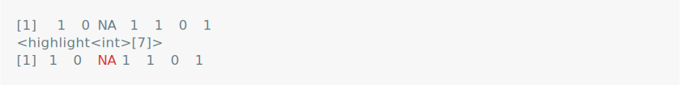
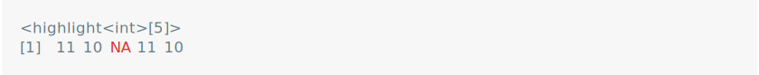
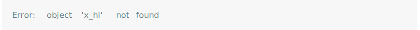
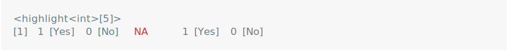
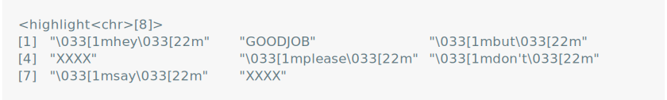
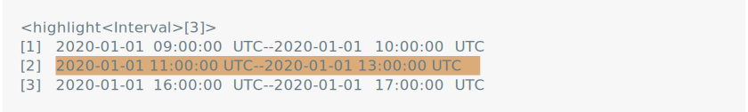

<!-- README.md is generated from README.Rmd. Please edit that file -->

# vlightr

<!-- badges: start -->
<!-- badges: end -->

vlightr is a package for

## Installation

You can install the development version of vlightr from
[GitHub](https://github.com/) with:

``` r
# install.packages("devtools")
devtools::install_github("EthanSansom/vlightr")
```

## Features

``` r
library(vlightr)
```

Conditionally format vector elements.

``` r
x <- c(1L, 0L, NA, 1L, 0L)
x_hl <- vlightr::highlight(x, is.na, vlightr::colour("red"))
x_hl
```

<picture>
<source media="(prefers-color-scheme: dark)" srcset="man/figures/README-/red-nas-dark.svg">
 </picture>

Highlighted vectors play well with other highlighted vectors of the same
type. The shorthand `hl()` is useful for quick highlighting.

``` r
x_hl + vlightr::hl(10L)
```

<picture>
<source media="(prefers-color-scheme: dark)" srcset="man/figures/README-/operation-dark.svg">
 </picture>

Coercion works as well.

``` r
c(x_hl, vlightr::hl(c(-1.5, NA)))
```

<picture>
<source media="(prefers-color-scheme: dark)" srcset="man/figures/README-/coerce-dark.svg">
 </picture>

Apply multiple conditional formats.

``` r
vlightr::highlight(
  x = x,
  conditions = list(
    is.na, 
    ~ .x == 1, 
    ~ .x == 0
  ),
  formatters = list(
    vlightr::colour("red"), 
    ~ paste(.x, "[Yes]"),
    ~ paste(.x, "[No]")
  )
)
```

<picture>
<source media="(prefers-color-scheme: dark)" srcset="man/figures/README-/multiple-formats-dark.svg">

</picture>

Use `dplyr::case_when()` style syntax for multiple conditional formats.

``` r
bad_words <- c("darn", "gosh")
affirmations <- c("good job", "way-to-go")
vlightr::highlight_case(
  x = c("hey", "good job", "but", "darn", "please", "don't", "say", "gosh"),
  .x %in% bad_words ~ \(x) strrep("X", nchar(x)),
  .x %in% affirmations ~ \(x) toupper(x),
  TRUE ~ cli::style_italic
)
```

<picture>
<source media="(prefers-color-scheme: dark)" srcset="man/figures/README-/case-syntax-dark.svg">

</picture>

Highlight’s are generic, meaning many S3 and S4 vector classes are
supported.

``` r
library(lubridate, warn.conflicts = FALSE)

today <- ymd("2020-01-01")
meeting_times <- interval(
  today + hours(c(9, 11, 16)), 
  today + hours(c(10, 13, 17))
)
lunch_break <- interval(today + hours(12), today + hours(13))
is_during_lunch <- function(x) int_overlaps(x, lunch_break)

vlightr::highlight(meeting_times, is_during_lunch, cli::bg_br_yellow)
```

<picture>
<source media="(prefers-color-scheme: dark)" srcset="man/figures/README-/generic-dark.svg">
 </picture>
