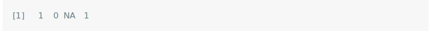
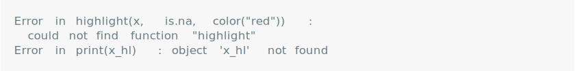

<!-- README.md is generated from README.Rmd. Please edit that file -->

# vlightr

<!-- badges: start -->
<!-- badges: end -->

vlightr is a package for

## Installation

You can install the development version of vlightr from
[GitHub](https://github.com/) with:

``` r
# install.packages("devtools")
devtools::install_github("EthanSansom/vlightr")
```

## Features

``` r
library(vlightr)
```

``` r
x <- c(1L, 0L, NA, 1L)
x_hl <- highlight(x, is.na, color("red"))
x_hl
#> <highlight<int>[4]>
#> [1] 1  0  NA 1
```

``` r
x <- c(1L, 0L, NA, 1L)
x
```

<picture>
<source media="(prefers-color-scheme: dark)" srcset="man/figures/README-/try-dark.svg">
 </picture>

``` r
x_hl <- highlight(x, is.na, color("red"))
print(x_hl)
```

<picture>
<source media="(prefers-color-scheme: dark)" srcset="man/figures/README-/again-dark.svg">
 </picture>

You’ll still need to render `README.Rmd` regularly, to keep `README.md`
up-to-date. `devtools::build_readme()` is handy for this. New text. More
new text. More.
