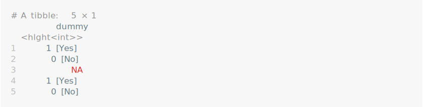
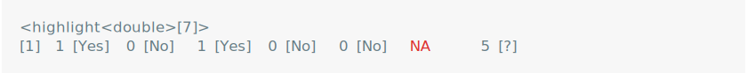
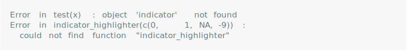
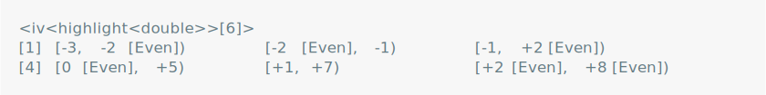
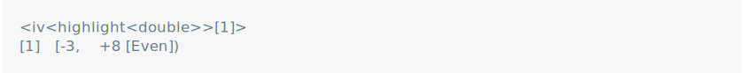

vlightr
================

<!-- README.md is generated from README.Rmd. Please edit that file -->
<!-- badges: start -->
<!-- badges: end -->

{vlightr} (read, “vector-highlighter”) makes it easy to identify
elements of interest in a vector printed to the console. It implements a
`<vlightr_highlight>` vector superclass which enhances the `format()`
and `print()` methods of generic vectors, allowing you to specify a
custom conditional formatting method for (almost) any vector type.

## Installation

⚠️ This package is still **under construction**. ⚠️

You can install the development version of vlightr from
[GitHub](https://github.com/) with:

``` r
# install.packages("devtools")
devtools::install_github("EthanSansom/vlightr")
```

## Features

``` r
library(vlightr)
library(dplyr, warn.conflicts = FALSE)
```

Want to identify an element of a vector? Highlight it with
`highlight()`.

``` r
x <- c(1, 8, 12, 4, 2)
maximum_hl <- vlightr::highlight(x, .t = ~ .x == max(.x))
print(maximum_hl)
```

<picture>
<source media="(prefers-color-scheme: dark)" srcset="man/figures/README-/max-values-dark.svg">
 </picture>

Highlighted elements change as the highlighted vector changes, so you
won’t lose them.

``` r
# `hl()` is shorthand for `highlight()`
sort(maximum_hl + vlightr::hl(10))
```

<picture>
<source media="(prefers-color-scheme: dark)" srcset="man/figures/README-/sort-demo-dark.svg">
 </picture>

Highlighted vectors can be used as `tibble::tibble()` columns too.

``` r
iris |>
  as_tibble() |>
  mutate(
    species = vlightr::highlight_mult(
      Species,
      "setosa" ~ vlightr::color("purple"),
      "versicolor" ~ vlightr::color("violet"),
      "virginica" ~ vlightr::color("pink")
    )
  ) |>
  group_by(species) |>
  summarize(
    avg_petal_length = vlightr::highlight(mean(Petal.Length), ~ .x == max(.x)),
    avg_sepal_width = vlightr::highlight(mean(Sepal.Width), ~ .x == max(.x))
  ) |>
  ungroup()
```

<picture>
<source media="(prefers-color-scheme: dark)" srcset="man/figures/README-/tibble-dark.svg">
 </picture>

Are you (or your boss) having a hard time finding that row you’re
looking for? Use `templight()` to temporarily highlight a vector by
index.

``` r
mtcars |>
  as_tibble(rownames = "make") |>
  mutate(across(everything(), ~ vlightr::templight(.x, make == "Datsun 710"))) |>
  select(make, mpg, disp, vs) |>
  head(5)
```

<picture>
<source media="(prefers-color-scheme: dark)" srcset="man/figures/README-/templight-dark.svg">
 </picture>

You can apply multiple conditional formats to a vector using
`highlight_mult()`. The left-hand-side is you a test function or a
literal value that you want to match and the right-hand-side is your
formatter function.

``` r
indicator <- vlightr::highlight_mult(
    c(1, 0, 1, 0, 0, NA, 5),
    is.na ~ vlightr::color("red"),
    0 ~ vlightr::label("No"),
    1 ~ vlightr::label("Yes"),
    !(.x %in% c(NA, 0, 1)) ~ paste(.x, "[?]")
)
print(indicator)
```

<picture>
<source media="(prefers-color-scheme: dark)" srcset="man/figures/README-/highlight-mult-dark.svg">

</picture>

Simplify the code above using `highligh_case()`, which provides a
`dplyr::case_when()` style interface and conditionally formats elements
using at most one formatter.

``` r
indicator <- vlightr::highlight_case(
    c(1, 0, 1, 0, 0, NA, 5),
    is.na ~ vlightr::color("red"),
    0 ~ vlightr::label("No"),
    1 ~ vlightr::label("Yes"),
    vlightr::true ~ paste(.x, "[?]") # Provide a default formatter
)
print(indicator)
```

<picture>
<source media="(prefers-color-scheme: dark)" srcset="man/figures/README-/highlight-case-dark.svg">

</picture>

If you want to re-use a highlight, make a `highlighter()` and friends.

``` r
indicator_highlighter <- vlightr::highlighter_case(
    is.na ~ vlightr::color("red"),
    0 ~ vlightr::label("No"),
    1 ~ vlightr::label("Yes"),
    vlightr::true ~ paste(.x, "[?]")
)
indicator_highlighter(c(0, 1, NA, -9))
```

<picture>
<source media="(prefers-color-scheme: dark)" srcset="man/figures/README-/highlighter-dark.svg">

</picture>

## Inspiration

The development of {vlightr} relied heavily on the following pacakges:

- [purrr](https://purrr.tidyverse.org/), which inspired the user
  interface of `highlight()`
- [dplyr](https://dplyr.tidyverse.org/), whose `case_when()` inspired
  `highlight_case()`
- [magrittr](https://magrittr.tidyverse.org/), whose `%>%` made the
  highlight pipe `%hl>%` possible
- [vctrs](https://vctrs.r-lib.org/index.html), for making S3 vectors
  easy to work with
- [usethis](https://usethis.r-lib.org/) and
  [pkgdown](https://pkgdown.r-lib.org/), which make every step of
  R-package and R-package-website development easier

This package is also heavily inspired by the
[ivs](https://github.com/DavisVaughan/ivs) package, which (also powered
by [vctrs](https://vctrs.r-lib.org/index.html)) implements generic
right-open intervals defined by a pair of parallel start and end
vectors.

As a testament to the genericity of the `<ivs_iv>`, here is an
ill-advised but perfectly legal interval vector.

``` r
library(ivs)

# Prepare highlighted numeric start and end vectors
starts <- vlightr::highlight(-3:2, ~ .x %% 2 == 0, ~ label("Even"))
ends <- vlightr::highlight(c(-2, -1, 2, 5, 7, 8), ~ .x > 0, ~ paste0("+", .x))

# Make an iv() with highlighted `starts` and `ends`
iv(starts, ends)
```

<picture>
<source media="(prefers-color-scheme: dark)" srcset="man/figures/README-/ivs-inspo1-dark.svg">
 </picture>

The interval vector can be manipulated as you’d expect.

``` r
iv_groups(iv(starts, ends))
```

<picture>
<source media="(prefers-color-scheme: dark)" srcset="man/figures/README-/ivs-inspo2-dark.svg">
 </picture>

And the interval vector can itself be highlighted.

``` r
vlightr::highlight(
  iv(starts, ends), 
  ~ (iv_end(.x) - iv_start(.x)) > hl(1),
  vlightr::color("goldenrod")
)
```

<picture>
<source media="(prefers-color-scheme: dark)" srcset="man/figures/README-/ivs-inspo3-dark.svg">
 </picture>
