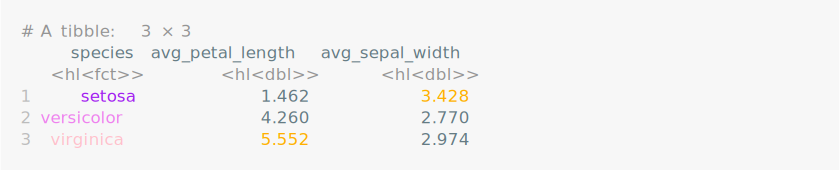
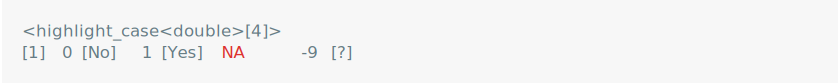

vlightr
================

<!-- README.md is generated from README.Rmd. Please edit that file -->

# vlightr

<!-- badges: start -->
<!-- badges: end -->

vlightr is a package for conditionally formatting vectors. You can
`highlight()` a vector to style, colour, or otherwise re-format it’s
elements when the vector is printed or formatted. Highlights are:

- **Persistent**, meaning highlighted vectors can be manipulated (with
  minimal legwork) while maintaining their custom formatting.
- **Generic**, meaning that many vectors you’ll encounter in the wild
  (ex. `ivs::iv`, `lubridate::interval`, `base::POSIXct`) and all base
  atomic vectors (`"logical"`, `"integer"`, `"numeric"`, `"complex"`,
  `"character"` and `"raw"`) can be highlighted.

# Installation

⚠️ This package is still **under construction**. ⚠️

You can install the development version of vlightr from
[GitHub](https://github.com/) with:

``` r
# install.packages("devtools")
devtools::install_github("EthanSansom/vlightr")
```

# Features

## Conditional Formatting

Apply a custom format to elements of `x` for which a condition returns
`TRUE`. For example, color only `NA` values red as they would appear in
a `tibble::tibble()`.

``` r
x <- c(1L, 0L, NA, 1L, 0L)
x_hl <- vlightr::highlight(x, is.na, vlightr::colour("red"))
print(x_hl)
```

<picture>
<source media="(prefers-color-scheme: dark)" srcset="man/figures/README-/red-nas1-dark.svg">
 </picture>

## Highlight, Un-Highlight, Re-Highlight

Highlighted vectors can’t be implicitly coerced or converted to another
vector type. To use a function which expects the highlight’s underlying
type (ex. an integer) first `un_highlight()` (AKA `ul()`) to expose the
highlighted data and then `re_highlight()` (AKA `rl()`) to re-apply the
conditional formatting.

``` r
x_hl |>
  vlightr::ul() |>
  as.logical() |>
  vlightr::rl(x_hl)
```

<picture>
<source media="(prefers-color-scheme: dark)" srcset="man/figures/README-/rehighlight1-dark.svg">

</picture>

The “highlight-pipe” `%hl>%` wraps the `magrittr::%>%` to do this
automatically.

``` r
x_hl %hl>% as.logical()
```

<picture>
<source media="(prefers-color-scheme: dark)" srcset="man/figures/README-/rehighlight2-dark.svg">

</picture>

Attempting to convert a `vlighter_highlight` vector to another class
will raise an error.

``` r
try(as.logical(x_hl))
```

<picture>
<source media="(prefers-color-scheme: dark)" srcset="man/figures/README-/rehighlight3-dark.svg">

</picture>

## Manipulate Highlighted Data

Highlighted vectors are happy to be cast or coerced to other compatible
highlights. The shorthand `hl()` is useful for quickly highlighting a
vector for this purpose.

``` r
# Arithmetic
x_hl + vlightr::hl(10L)
```

<picture>
<source media="(prefers-color-scheme: dark)" srcset="man/figures/README-/operation-dark.svg">
 </picture>

``` r
# Assignment
x_hl[[1]] <- vlightr::hl(NA)
x_hl
```

<picture>
<source media="(prefers-color-scheme: dark)" srcset="man/figures/README-/assign-dark.svg">
 </picture>

``` r
# Coercion
c(x_hl, vlightr::hl(c(-1.5, NA)))
```

<picture>
<source media="(prefers-color-scheme: dark)" srcset="man/figures/README-/coerce-dark.svg">
 </picture>

## Multiple Conditional Formats

``` r
dummies <- vlightr::highlight(
  x = x,
  conditions = list(
    is.na, 
    ~ .x == 1, 
    ~ .x == 0
  ),
  formatters = list(
    vlightr::colour("red"), 
    ~ paste(.x, "[Yes]"),
    ~ paste(.x, "[No]")
  )
)
dummies
```

<picture>
<source media="(prefers-color-scheme: dark)" srcset="man/figures/README-/multiple-formats-dark.svg">

</picture>

## Column Rendering in `tibble::tibble()`

``` r
tibble::tibble(dummy = dummies)
```

<picture>
<source media="(prefers-color-scheme: dark)" srcset="man/figures/README-/tibble-dark.svg">
 </picture>

## Define Highlighter Functions

``` r
dummy_highlighter <- vlightr::as_highlighter(dummies)
dummy_highlighter(c(0, 1, NA))
```

<picture>
<source media="(prefers-color-scheme: dark)" srcset="man/figures/README-/highlighter-dark.svg">

</picture>

## Alternate `dplyr::case_when()` Style Syntax

``` r
bad_words <- c("darn", "gosh")
affirmations <- c("good job", "way-to-go")
message <- c("hey", "good job", "but", "darn", "please", "don't", "say", "gosh")

vlightr::highlight_case(
  message,
  .x %in% bad_words ~ strrep("X", nchar(.x)),
  .x %in% affirmations ~ toupper(.x),
  TRUE ~ cli::style_italic
)
```

<picture>
<source media="(prefers-color-scheme: dark)" srcset="man/figures/README-/case-syntax-dark.svg">

</picture>

## Highlight Arbitrary Vectors

Highlighted vectors are generic, meaning that S3 and S4 vector classes
from other packages are highlight-able.

``` r
library(lubridate, warn.conflicts = FALSE)

today <- ymd("2020-01-01")
meeting_times <- interval(
  today + hours(c(9, 11, 16)), 
  today + hours(c(10, 13, 17))
)
lunch_break <- interval(today + hours(12), today + hours(13))
is_during_lunch <- function(x) int_overlaps(x, lunch_break)

vlightr::highlight(meeting_times, is_during_lunch, cli::col_magenta)
```

<picture>
<source media="(prefers-color-scheme: dark)" srcset="man/figures/README-/generic-dark.svg">
 </picture>

# Inspiration

This package is heavily inspired by the
[ivs](https://github.com/DavisVaughan/ivs) package, which implements
generic right-open intervals defined by a pair of parallel start and end
vectors.

As a testament to the genericity of the `ivs::iv`, here is an
ill-advised but perfectly legal interval vector.

``` r
library(ivs)

starts <- highlight(-3:2, ~ .x %% 2 == 0, ~ paste(.x, "[Even]"))
ends <- highlight(c(-2, -1, 2, 5, 7, 8), ~ .x > 0, ~ paste0("+", .x))

# A totally legitimate `iv`
ivs::iv(starts, ends)
#> <iv<highlight<double>>[6]>
#> [1] [-3, -2 [Even])        [-2 [Even], -1)        [-1, +2 [Even])       
#> [4] [0 [Even], +5)         [+1, +7)               [+2 [Even], +8 [Even])
# We can even manipulate it
ivs::iv_groups(ivs::iv(starts, ends))
#> <iv<highlight<double>>[1]>
#> [1] [-3, +8 [Even])
# Or highlight it...
highlight(
  ivs::iv(starts, ends), 
  ~ (ivs::iv_end(.x) - ivs::iv_start(.x)) > hl(1),
  ~ paste("{", .x, "}")
)
#> <highlight<iv<highlight<double>>>[6]>
#> [1] [-3, -2 [Even])            [-2 [Even], -1)           
#> [3] { [-1, +2 [Even]) }        { [0 [Even], +5) }        
#> [5] { [+1, +7) }               { [+2 [Even], +8 [Even]) }
```
