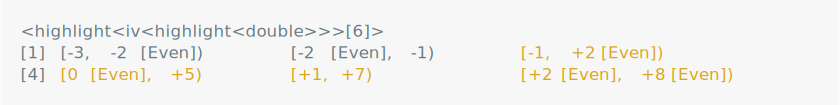

vlightr
================

<!-- README.md is generated from README.Rmd. Please edit that file -->
<!-- badges: start -->
<!-- badges: end -->

vlightr is a package for conditionally formatting vectors. You can
`highlight()` a vector to style, color, or otherwise re-format it’s
elements when the vector is printed or formatted. Highlights are:

- **Persistent**, meaning highlighted vectors can be manipulated (with
  minimal legwork) while maintaining their custom formatting.
- **Generic**, meaning that many vectors you’ll encounter in the wild
  and all base atomic vectors (`"logical"`, `"integer"`, `"numeric"`,
  `"complex"`, `"character"` and `"raw"`) can be highlighted.

## Installation

⚠️ This package is still **under construction**. ⚠️

You can install the development version of vlightr from
[GitHub](https://github.com/) with:

``` r
# install.packages("devtools")
devtools::install_github("EthanSansom/vlightr")
```

## Features

``` r
library(vlightr)
library(lubridate, warn.conflicts = FALSE)
library(ivs)
```

Quickly customize how a vector is printed.

``` r
dates <- lubridate::ymd("20240619") + lubridate::weeks(-3:2)

format_roygbiv1 <- function(x) {
  vroygbi <- c("violet", "red", "orange", "gold", "green", "blue", "purple")
  crayons <- lapply(vroygbi, vlightr::color)
  letters <- strsplit(as.character(x), "")[[1]]
  letters |>
    mapply(seq_along(letters), FUN = \(x, i) crayons[[i %% 7 + 1]](x)) |>
    paste(collapse = "")
}
format_roygbiv <- function(x) sapply(x, format_roygbiv1)

dates <- vlightr::highlight(dates, ~ lubridate::month(.x) == 6, format_roygbiv)
print(dates)
```

<picture>
<source media="(prefers-color-scheme: dark)" srcset="man/figures/README-/june1-dark.svg">
 </picture>

And how a column is displayed.

``` r
tibble::tibble(
  month = lubridate::month(vlightr::ul(dates), label = TRUE),
  date = dates
)
```

<picture>
<source media="(prefers-color-scheme: dark)" srcset="man/figures/README-/june2-dark.svg">
 </picture>

### Highlight, Un-Highlight, Re-Highlight

Highlighted vectors can’t be implicitly coerced or converted to another
vector type. To use a function which expects the highlight’s underlying
type (ex. a date) first `un_highlight()` (AKA `ul()`) to expose the
highlighted data and then `re_highlight()` (AKA `rl()`) to re-apply the
conditional formatting.

``` r
dates |>
  vlightr::ul() |>
  lubridate::rollback() |>
  vlightr::rl(dates)
```

<picture>
<source media="(prefers-color-scheme: dark)" srcset="man/figures/README-/rehighlight1-dark.svg">

</picture>

The “highlight-pipe” `%hl>%` wraps the magrittr `%>%` to do this
automatically.

``` r
dates %hl>% lubridate::rollback()
```

<picture>
<source media="(prefers-color-scheme: dark)" srcset="man/figures/README-/rehighlight2-dark.svg">

</picture>

### Manipulate Highlighted Data

Highlighted vectors are happy to be cast or coerced to other compatible
highlights. The shorthand `hl()` is useful for quickly highlighting a
vector for this purpose.

``` r
# Arithmetic
dates + vlightr::hl(17)
```

<picture>
<source media="(prefers-color-scheme: dark)" srcset="man/figures/README-/operation-dark.svg">
 </picture>

``` r
# Assignment
dates[[1]] <- vlightr::hl(NA)
dates
```

<picture>
<source media="(prefers-color-scheme: dark)" srcset="man/figures/README-/assign-dark.svg">
 </picture>

``` r
# Coercion
c(dates, vlightr::hl(lubridate::ymd_hm("2020-06-01 12:00")))
```

<picture>
<source media="(prefers-color-scheme: dark)" srcset="man/figures/README-/coerce-dark.svg">
 </picture>

### Multiple Conditional Formats

Multiple conditions and formatters can be specified by supplying lists
of functions or purrr-style lambdas. Elements of `x` for which
`conditions[[i]](x)` is `TRUE` are formatted using the formatter
function `formatters[[i]]`.

``` r
dummies <- vlightr::highlight(
  x = c(1L, 0L, NA, 1L, 0L),
  conditions = list(
    is.na, 
    ~ .x == 1, 
    ~ .x == 0
  ),
  formatters = list(
    vlightr::color("red"),
    ~ paste(.x, "[Yes]"),
    ~ paste(.x, "[No]")
  )
)
dummies
```

<picture>
<source media="(prefers-color-scheme: dark)" srcset="man/figures/README-/multiple-formats-dark.svg">

</picture>

`highlight_case()` provides a `dplyr::case_when()` inspired syntax for
defining multiple conditional formats.

``` r
bad_words <- c("darn", "gosh")
affirmations <- c("good job", "way-to-go")
message <- c("hey", "good job", "but", "darn", "please", "don't", "say", "gosh")

vlightr::highlight_case(
  message,
  .x %in% bad_words ~ strrep("X", nchar(.x)),
  .x %in% affirmations ~ toupper(.x),
  TRUE ~ cli::style_italic
)
```

<picture>
<source media="(prefers-color-scheme: dark)" srcset="man/figures/README-/case-syntax-dark.svg">

</picture>

### Define Highlighter Functions

Re-use the formatting of any highlighted vector by converting it into a
highlighter.

``` r
dummy_highlighter <- vlightr::as_highlighter(dummies)
dummy_highlighter(c(0, 1, NA))
```

<picture>
<source media="(prefers-color-scheme: dark)" srcset="man/figures/README-/highlighter-dark.svg">

</picture>

### Highlight Arbitrary Vectors

Highlights are generic, meaning that S3 and S4 vector classes from other
packages are highlight-able.

``` r
today <- lubridate::ymd("2020-01-01")
meeting_times <- lubridate::interval(
  today + lubridate::hours(c(9, 11, 16)), 
  today + lubridate::hours(c(10, 13, 17))
)
lunch_break <- lubridate::interval(
  today + lubridate::hours(12), 
  today + lubridate::hours(13)
)
is_during_lunch <- function(x) lubridate::int_overlaps(x, lunch_break)

vlightr::highlight(meeting_times, is_during_lunch, cli::col_magenta)
```

<picture>
<source media="(prefers-color-scheme: dark)" srcset="man/figures/README-/generic-dark.svg">
 </picture>

## Inspiration

This package is heavily inspired by the
[ivs](https://github.com/DavisVaughan/ivs) package, which implements
generic right-open intervals defined by a pair of parallel start and end
vectors.

As a testament to the genericity of the `ivs::iv`, here is an
ill-advised but perfectly legal interval vector.

``` r
starts <- vlightr::highlight(-3:2, ~ .x %% 2 == 0, ~ paste(.x, "[Even]"))
ends <- vlightr::highlight(c(-2, -1, 2, 5, 7, 8), ~ .x > 0, ~ paste0("+", .x))

# A totally legitimate `iv`
ivs::iv(starts, ends)
```

<picture>
<source media="(prefers-color-scheme: dark)" srcset="man/figures/README-/ivs-inspo1-dark.svg">
 </picture>

``` r
# We can even manipulate it
ivs::iv_groups(ivs::iv(starts, ends))
```

<picture>
<source media="(prefers-color-scheme: dark)" srcset="man/figures/README-/ivs-inspo2-dark.svg">
 </picture>

``` r
# Or highlight it...
vlightr::highlight(
  ivs::iv(starts, ends), 
  ~ (ivs::iv_end(.x) - ivs::iv_start(.x)) > vlightr::hl(1),
  color("goldenrod")
)
```

<picture>
<source media="(prefers-color-scheme: dark)" srcset="man/figures/README-/ivs-inspo3-dark.svg">
 </picture>
