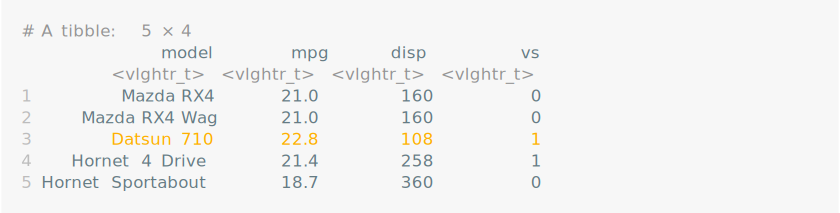

vlightr
================

<!-- README.md is generated from README.Rmd. Please edit that file -->
<!-- badges: start -->
<!-- badges: end -->

{vlightr} is a package for highlighting vectors. It provides a
<vlightr_highlight> superclass which enhances the `format()` and
`print()` method of generic vectors.

## Installation

⚠️ This package is still **under construction**. ⚠️

You can install the development version of vlightr from
[GitHub](https://github.com/) with:

``` r
# install.packages("devtools")
devtools::install_github("EthanSansom/vlightr")
```

## Features

``` r
library(vlightr)
library(dplyr, warn.conflicts = FALSE)
```

Want to identify an element of a vector? Highlight it with
`highlight()`.

``` r
x <- c(1, 8, 12, 4, 2)
# maximum_hl <- vlightr::highlight(x, .t = ~ .x == max(.x), .f = ~ vlightr::bg("br_yellow"))
maximum_hl <- vlightr::highlight(x, .t = ~ .x == max(.x))
print(maximum_hl)
```

<picture>
<source media="(prefers-color-scheme: dark)" srcset="man/figures/README-/max-values-dark.svg">
 </picture>

Highlighted elements change as the highlighted vector changes, so you
won’t lose them.

``` r
# `hl()` is shorthand for `highlight()`
sort(maximum_hl + vlightr::hl(10))
```

<picture>
<source media="(prefers-color-scheme: dark)" srcset="man/figures/README-/sort-demo-dark.svg">
 </picture>

Highlighted vectors can be used as tibble::tibble() columns too.

``` r
mtcars |>
    as_tibble(rownames = "make") |>
    mutate(
        make = vlightr::highlight(make, ~ grepl("Mazda", .x), toupper),
        am = vlightr::highlight_mult(
          am,
          0 ~ vlightr::label("automatic"),
          1 ~ vlightr::label("manual")
        )
    ) |>
    select(make, mpg, disp, am)
#> # A tibble: 32 × 4
#>                 make   mpg  disp            am
#>            <hl<chr>> <dbl> <dbl>     <hl<dbl>>
#>  1         MAZDA RX4  21    160     1 [manual]
#>  2     MAZDA RX4 WAG  21    160     1 [manual]
#>  3        Datsun 710  22.8  108     1 [manual]
#>  4    Hornet 4 Drive  21.4  258  0 [automatic]
#>  5 Hornet Sportabout  18.7  360  0 [automatic]
#>  6           Valiant  18.1  225  0 [automatic]
#>  7        Duster 360  14.3  360  0 [automatic]
#>  8         Merc 240D  24.4  147. 0 [automatic]
#>  9          Merc 230  22.8  141. 0 [automatic]
#> 10          Merc 280  19.2  168. 0 [automatic]
#> # ℹ 22 more rows
```

Are you (or your boss) having a hard time finding that row you’re
looking for? Use `templight()` to temporarily highlight a vector by
index instead of using a test function.

``` r
mtcars |>
    as_tibble(rownames = "make") |>
    mutate(across(everything(), ~ vlightr::templight(.x, make == "Datsun 710"))) |>
    select(make, mpg, disp, vs)
```

<picture>
<source media="(prefers-color-scheme: dark)" srcset="man/figures/README-/templight-dark.svg">
 </picture>

You can apply multiple conditional formats to a vector using
`highlight_mult()`. The left-hand-side is you a test function or a
literal value that you want to match and the right-hand-side is your
formatter function.

``` r
indicator <- highlight_mult(
    c(1, 0, 1, 0, 0, NA, 5),
    is.na ~ color("red"),
    0 ~ label("No"),
    1 ~ label("Yes"),
    !(.x %in% c(NA, 0, 1)) ~ paste(.x, "[?]")
)
print(indicator)
#> <highlight<double>[7]>
#> [1] 1 [Yes] 0 [No]  1 [Yes] 0 [No]  0 [No]  NA      5 [?]
```

Simplify the code above using `highligh_case()`, which provides a
`dplyr::case_when()` style interface and conditionally formats elements
using at most one formatter.

``` r
indicator <- highlight_case(
    c(1, 0, 1, 0, 0, NA, 5),
    is.na ~ color("red"),
    0 ~ label("No"),
    1 ~ label("Yes"),
    true ~ paste(.x, "[?]") # Use `true()` to provide a default formatter
)
print(indicator)
#> <highlight_case<double>[7]>
#> [1] 1 [Yes] 0 [No]  1 [Yes] 0 [No]  0 [No]  NA      5 [?]
```

If you want to re-use a highlight, turn it into a `highlighter()`.

``` r
indicator_highlighter <- as_highlighter(indicator)
indicator_highlighter(c(0, 1, NA, -9))
#> <highlight_case<double>[4]>
#> [1] 0 [No]  1 [Yes] NA      -9 [?]
```

## Inspiration

This package is heavily inspired by the
[ivs](https://github.com/DavisVaughan/ivs) package, which implements
generic right-open intervals defined by a pair of parallel start and end
vectors.

As a testament to the genericity of the `ivs::iv`, here is an
ill-advised but perfectly legal interval vector.

``` r
library(ivs)
starts <- highlight(-3:2, ~ .x %% 2 == 0, ~ label("Even"))
ends <- highlight(c(-2, -1, 2, 5, 7, 8), ~ .x > 0, ~ paste0("+", .x))

# Make an iv() with highlighted `starts` and `ends`
iv(starts, ends)
#> <iv<highlight<double>>[6]>
#> [1] [-3, -2 [Even])        [-2 [Even], -1)        [-1, +2 [Even])       
#> [4] [0 [Even], +5)         [+1, +7)               [+2 [Even], +8 [Even])
```

``` r
# Manipulate your iv()
iv_groups(iv(starts, ends))
#> <iv<highlight<double>>[1]>
#> [1] [-3, +8 [Even])
```

``` r
# Highlight your iv()
highlight(
  iv(starts, ends), 
  ~ (iv_end(.x) - iv_start(.x)) > hl(1),
  color("goldenrod")
)
#> <highlight<iv<highlight<double>>>[6]>
#> [1] [-3, -2 [Even])        [-2 [Even], -1)        [-1, +2 [Even])       
#> [4] [0 [Even], +5)         [+1, +7)               [+2 [Even], +8 [Even])
```
